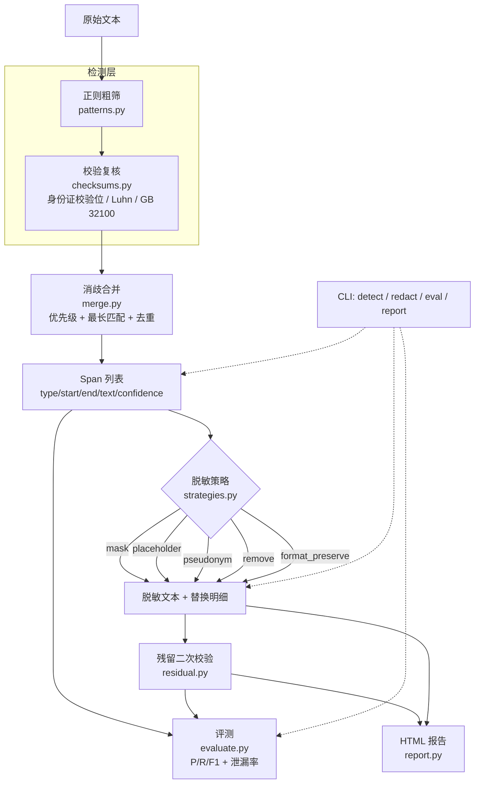

# pii-redactor · 敏感信息识别与脱敏工具箱

[](https://github.com/wangzhao-cs/pii-redactor/actions/workflows/ci.yml)
[](https://github.com/wangzhao-cs/pii-redactor)
[](https://github.com/wangzhao-cs/pii-redactor)
[](LICENSE)

**面向中文 / 中英混合文本的敏感信息（PII 与敏感凭据）检测、脱敏与「脱敏后残留二次校验」工具箱。**
核心功能零第三方依赖（纯标准库，Python ≥ 3.9），校验算法（身份证校验位、Luhn、统一社会信用代码）自行实现，
检测结果可量化评测（span 级 P/R/F1 + 残留泄漏率）。

---

## 背景与应用场景

数据安全 / DLP 场景里，"脱敏"经常只做了一半：写个正则把手机号换成 `****`，就认为数据可以出库了。
真实事故往往出在两个地方 —— **正则没覆盖到的类型**，以及 **写错边界导致部分字符残留**（例如 `138-0013-8000`
只替换了前 3 位）。这两类问题靠"人工看一眼"很难发现，靠"再写一个正则"也无法证明。

本项目把脱敏当成一条**可验证的流水线**来处理：

| 场景 | 用法 |
| --- | --- |
| 工单 / 聊天记录 / 日志入库前脱敏 | `pii_redactor.redact()` 或 CLI `redact` |
| 数据集、语料发布前脱敏 | `redact` + `--fail-on-leak` 作为发布门禁 |
| 已有脱敏流程的有效性复核 | `check_residual()` 对脱敏结果做二次校验，输出泄漏率与残留明细 |
| 脱敏方案对比与调参 | CLI `eval` 输出分类型 P/R/F1 与泄漏率 |
| 人工复核 | CLI `report` 生成单文件 HTML 对比视图（原文 / 脱敏结果并排 + 实体明细） |

设计上有意做了两件事：

1. **只靠正则不叫检测**：中国大陆身份证号走 GB 11643 / ISO 7064 MOD 11-2 校验位，
   银行卡走 Luhn，统一社会信用代码走 GB 32100 校验字符。先粗筛"长得像"，再验证"真的是"，
   把误报压到可接受范围。
2. **脱敏完必须自证**：脱敏后重新全量扫描 + 强校验类型专项判定，输出"还剩多少敏感信息"，
   而不是"我做了脱敏"。

---

## 特性

### 检测能力（12 类 PII + 4 类凭据）

| 类型 | 说明 | 判定依据 |
| --- | --- | --- |
| `ID_CARD` | 中国大陆居民身份证号 | 18 位结构 + **ISO 7064 MOD 11-2 校验位** + 出生日期合理性 |
| `BANK_CARD` | 银行卡号 / 对公账号 | 16–19 位 + **Luhn 校验** + BIN 首位合理性，支持空格/短横线分隔 |
| `USCC` | 统一社会信用代码 | 18 位 + **GB 32100 校验字符**（31 进制，剔除 I/O/S/V/Z） |
| `PHONE` | 手机号、带区号固话 | `+86` / `86` 前缀与分隔符归一化后校验号段 |
| `EMAIL` | 电子邮箱 | 结构 + 域名校验 |
| `IPV4` / `IPV6` | IP 地址 | 正则粗筛 + `ipaddress` 模块复核；版本号（`1.2.3.4 版本`）不予命中 |
| `MAC` | MAC 地址 | 冒号 / 短横线分隔 |
| `PLATE` | 机动车号牌 | 省份简称 + 发牌机关字母 + 序号，区分普通牌与**新能源牌**（D/F） |
| `PASSPORT` | 护照号（启发式） | `E`/`G` + 8 位数字，保守策略 |
| `ADDRESS` | 中文地址（启发式） | 省/市/区县 + 街道/路/镇 + 门牌号，自动剥离"开户行在""位于"等引导词 |
| `PERSON_NAME` | 中文人名（保守） | 约 200 个单字姓氏 + 复姓词典，**必须命中"姓名：/客户/申请人"等上下文或"先生/女士"敬称** |
| `API_KEY` | API Key / Access Key | `sk-`、`AKIA`、`ghp_/gho_`、`AIza`、`xox*`、`LTAI`、`AKID` 等前缀 + 通用键值型（≥16 位） |
| `JWT` | JSON Web Token | 三段 Base64URL 结构（`eyJ` 开头） |
| `PRIVATE_KEY` | PEM 私钥块 | `BEGIN/END ... PRIVATE KEY` 整体命中（跨行） |
| `PASSWORD_KV` | 口令键值对 | `password/passwd/pwd/密码/口令` + 分隔符，**只脱敏值本身** |

### 消歧与脱敏

- **重叠消歧**：多个检测器同时命中时，按「类型优先级 → 最长匹配 → 稳定排序」裁决（凭据 > 强校验标识 > 弱启发式），
  保证输出互不重叠且可复现。
- **五种脱敏策略**：

  | 策略 | 效果示例（原文 `13800138000`） | 适用场景 |
  | --- | --- | --- |
  | `mask` | `138****8000` | 需要保留可读性 / 人工核对 |
  | `placeholder` | `<PHONE_1>` | 需要占位符回填，同类型独立编号 |
  | `pseudonym` | `13000079450`（假名） | 需要**一致性**：同原文恒得同一假名，可跨文档按人关联 |
  | `remove` | ``（删除） | 不需要保留结构 |
  | `format_preserve` | `***********`（等长） | 需要保持文本长度/对齐（如固定宽度报表） |

- **一致性假名**：种子 + 原文哈希派生，**不依赖出现顺序**；中文人名走"张某 / 张某甲"式匿名化（姓氏池 + 同姓冲突用「甲乙丙」区分）；
  生成的证件号、卡号**故意不通过校验算法**，邮箱使用 `example.com`，IP 落在 RFC 5737 文档网段，避免假数据被误用。

### 残留二次校验（本项目的核心差异点）

对脱敏结果重跑**全部**检测器，分三层输出：

1. 全量重扫：残留命中明细（位置、类型、上下文）；
2. 专项判定：仍存在通过校验位 / Luhn / 结构验证的强类型（身份证、银行卡、信用代码、凭据）即判**泄漏**；
3. 泄漏率：与脱敏前的实体逐一比对，计算"原值仍逐字存在"的比例（不依赖二次检测的召回，因此能真实反映漏检后果）。

配套的"CI 门禁"用法：`redact --fail-on-leak` 在发现残留时以退出码 `2` 结束。

### 评测与报告

- 内置**合成标注集**：8 篇虚构文档（简历、客服工单、聊天记录、实名表单、合同片段、系统日志导出、边界样本、误报压测文本），
  81 个金标 span，逐条人工标注（偏移由脚本计算并双向校验）；
- 输出 span 级 **Precision / Recall / F1**：分类型 + micro + macro（支持 `exact` 精确匹配与 `relaxed` 重叠匹配两种口径）；
- 输出**残留泄漏率**：完整流水线与"只脱敏手机号+身份证"的部分流水线对比；
- `report` 生成**单文件 HTML** 报告：内联 CSS/JS、零外部资源、可按类型筛选高亮、并排对比原文与脱敏结果。

---

## 架构



代码分层：`models`（数据结构）→ `patterns`/`names`（词表与正则）→ `checksums`（算法）→ `detectors`（检测器）→
`merge`（消歧）→ `strategies`（脱敏）→ `residual`（校验）→ `evaluate`/`report`/`cli`（对外能力）。
上层依赖下层，`detectors` 与 `residual` 之间无循环依赖，新增一种敏感信息只需实现一个 `Detector` 子类并登记优先级。

---

## 安装

核心功能**零依赖**，不需要安装任何东西即可运行测试与 CLI：

```bash
git clone https://github.com/wangzhao-cs/pii-redactor.git
cd pii-redactor
python -m unittest discover -s tests -v        # 178 个用例，零安装可跑
PYTHONPATH=src python -m pii_redactor detect data/samples/01_resume.md   # 免安装运行 CLI（安装后可直接用 pii-redactor 命令）
```

作为包使用（会得到 `pii-redactor` 命令）：

```bash
pip install .                # 核心，无第三方依赖
pip install ".[fastapi]"     # 可选：HTTP 服务包装
pip install ".[jieba]"       # 可选：分词增强（缺失时自动降级，不影响核心功能）
pip install ".[all,dev]"     # 可选：全部 extras + 开发工具
```

运行本仓库时使用的解释器为 Python 3.11（`pyproject.toml` 声明 `requires-python = ">=3.9"`，
CI 覆盖 3.10 / 3.11 / 3.12）。

---

## 快速开始

> 命令均在仓库根目录运行；未执行 `pip install .` 时请在命令前加 `PYTHONPATH=src`（安装后可用 `pii-redactor` 命令替代 `python -m pii_redactor`）。

以下输出均为本机实际运行结果（Python 3.11.15 / macOS）。

### 1. 检测

```bash
$ python -m pii_redactor detect data/samples/01_resume.md
输入：data/samples/01_resume.md（420 字符）
检出 8 处敏感信息：
#    类型                   位置         内容                       检测器
1    PERSON_NAME(中文人名)  73-76        李文博                     person_name
2    PHONE(电话号码)        108-125      +86 139 1234 5678          phone
3    EMAIL(电子邮箱)        133-156      liwenbo1990@example.c…     email
4    ID_CARD(身份证号)      164-182      110101199003078515         id_card
5    ADDRESS(地址)          190-204      北京市海淀区中关村大街27号 address
6    BANK_CARD(银行卡号)    365-382      62220212345678903          bank_card
7    PERSON_NAME(中文人名)  397-400      王秀兰                     person_name
8    PHONE(电话号码)        406-419      137-8899-0011              phone
```

加 `--json` 可得到机器可读结果（含归一化号码、出生日期、BIN、命中的上下文等 `meta` 字段）。

### 2. 脱敏

```bash
$ python -m pii_redactor redact data/samples/01_resume.md -s mask
# 个人简历（虚构合成数据）

> 本文件由测试用例生成，所有姓名、号码、地址均为虚构，不对应任何真实个人或机构。

## 基本信息

- 姓名：李**
- 性别：男
- 出生日期：1990-03-07
- 手机号：139****5678
- 电子邮箱：li*********@example.com
- 身份证号：110101********8515
- 现居住地：北京市海淀区******7号
...
- 工资卡号：622202*******8903（招商银行）
- 紧急联系人：王**   电话 137****0011
策略=mask 命中=8 {'PERSON_NAME': 2, 'PHONE': 2, 'ADDRESS': 1, 'BANK_CARD': 1, 'EMAIL': 1, 'ID_CARD': 1}
残留校验通过：未发现泄漏（强类型残留 0 处，泄漏率 0.00%）
```

一致性假名（同一原文恒得同一假名，可跨文档按人关联；同姓不同人用「甲乙丙」区分）：

```bash
$ python examples/api_demo.py | grep -A2 '\[pseudonym\]'
[pseudonym]
  姓名：黄某，手机 19000069031，身份证 110101190001010468，邮箱 userf732@example.com，工资卡 6222091256250506。
  残留校验通过：未发现泄漏（强类型残留 0 处，泄漏率 0.00%）
```

日志类文档用占位符策略（凭据、私钥、JWT 一并处理）：

```bash
$ python -m pii_redactor redact data/samples/06_system_log.md -s placeholder
2026-09-16 03:15:19 DEBUG config loaded api_key=<API_KEY_1>
2026-09-16 03:15:20 DEBUG aws   credentials <API_KEY_2> region=cn-north-1
2026-09-16 03:18:01 DEBUG db    connect password=<PASSWORD_KV_1> user=app_ro host=<IPV4_3>
2026-09-16 03:19:33 DEBUG token issued <JWT_1>
2026-09-16 03:21:10 INFO  ops   oncall phone <PHONE_1>
2026-09-16 03:22:00 INFO  ops   reload certificate, private key file content:
<PRIVATE_KEY_1>
```

### 3. 残留二次校验 / 发布门禁

只脱敏手机号时，校验器会指出还剩什么（**退出码 2**，可直接用作 CI 门禁）：

```bash
$ python -m pii_redactor redact data/samples/01_resume.md --types PHONE -s format_preserve -o /dev/null --fail-on-leak
策略=format_preserve 命中=2 {'PHONE': 2}
残留校验未通过：强校验残留 2 处（身份证号、银行卡号）；泄漏率 75.00%（6/8）
$ echo $?
2
```

Python API 里同样可以单独调用（无需脱敏，直接对任意文本复核）：

```python
from pii_redactor import check_residual

report = check_residual("身份证 110101199003078515")
print(report.summary())     # 残留校验未通过：强校验残留 1 处（身份证号）
print(report.to_dict())     # 含泄漏率、残留位置、强类型判定明细
```

### 4. 评测

```bash
$ python -m pii_redactor eval
类型                   TP FP FN 精确率 召回率     F1
----------------------------------------------------
PERSON_NAME(中文人名)  16  0  4 1.0000 0.8000 0.8889
PHONE(电话号码)        10  1  1 0.9091 0.9091 0.9091
EMAIL(电子邮箱)         8  0  1 1.0000 0.8889 0.9412
ADDRESS(地址)           7  0  0 1.0000 1.0000 1.0000
ID_CARD(身份证号)       5  0  1 1.0000 0.8333 0.9091
BANK_CARD(银行卡号)     4  0  0 1.0000 1.0000 1.0000
IPV4(IPv4 地址)         4  0  0 1.0000 1.0000 1.0000
MAC(MAC 地址)           3  0  1 1.0000 0.7500 0.8571
PASSWORD_KV(口令字段)   3  0  1 1.0000 0.7500 0.8571
API_KEY(API 密钥)       3  0  0 1.0000 1.0000 1.0000
USCC(统一社会信用代码)  3  0  0 1.0000 1.0000 1.0000
PLATE(车牌号)           1  0  1 1.0000 0.5000 0.6667
IPV6(IPv6 地址)         1  0  0 1.0000 1.0000 1.0000
JWT(JWT 令牌)           1  0  0 1.0000 1.0000 1.0000
PASSPORT(护照号)        1  0  0 1.0000 1.0000 1.0000
PRIVATE_KEY(私钥块)     1  0  0 1.0000 1.0000 1.0000
micro                  71  1 10 0.9861 0.8765 0.9281
macro(16类)             -  -  - 0.9943 0.9020 0.9393
----------------------------------------------------
泄漏率[full_pipeline, 策略=mask]: 11.11% (9/81)  二次校验捕获 0 处  强类型残留 2/22
泄漏率[partial_pipeline_phone_id, 策略=mask]: 80.25% (65/81)  二次校验捕获 56 处  强类型残留 17/22
```

`--json results/eval.json` 会输出完整结构化结果（含每篇文档的 FP / FN 明细），`--mode relaxed`
切换为"同类型且有重叠即算命中"的口径。

### 5. HTML 报告

```bash
$ python -m pii_redactor report data/samples/02_support_ticket.md -o results/ticket_report.html
报告已生成：results/ticket_report.html（命中 10 处，策略 mask）
残留校验通过：未发现泄漏（强类型残留 0 处，泄漏率 0.00%）
```

报告为单文件（无外链、无 CDN、可离线打开 / 直接归档），包含统计卡片、原文与脱敏结果并排高亮、
按类型筛选、实体明细表与残留校验结论。

### 6. Python API

```python
from pii_redactor import Redactor, detect, redact_text, check_residual

text = "姓名：李文博，手机 +86 139 1234 5678，身份证 110101199003078515。"

detect(text)                                  # -> [Span(PERSON_NAME), Span(PHONE), Span(ID_CARD)]
redact_text(text, strategy="mask")            # -> "姓名：李**，手机 139****5678，身份证 110101********8515。"
redact_text(text, strategy="placeholder")     # -> "姓名：<PERSON_NAME_1>，手机 <PHONE_1>，身份证 <ID_CARD_1>。"

# 只关心某几类 + 自定义种子
Redactor(types=["PHONE", "ID_CARD"], strategy="pseudonym", seed="my-seed").redact(text).redacted

# 一致性假名：同一原文 -> 同一假名
redact_text("申请人：王强；审核人：王强；担保人：李明。", strategy="pseudonym")
# -> "申请人：吴某；审核人：吴某；担保人：杨某。"
```

可选依赖（未安装时优雅降级，不影响核心）：

```python
from pii_redactor.extras import create_app, name_candidates, segment   # FastAPI 包装 / jieba 分词增强
```

---

## 实测评测结果

> **评测口径与诚实声明**：内置标注集是**与本实现同源的合成语料**（8 篇虚构文档 / 81 个金标 span），
> 用于回归与弱点量化，**不代表真实分布上的泛化能力**；所有数字均由 `python -m pii_redactor eval` 现场产生，
> 可用 `--json` 复现。真实业务数据上，地址、人名等启发式类型的指标会明显低于下表。

### 1. 检测指标（exact 精确匹配，8 篇文档 / 81 金标 span）

| 范围 | TP | FP | FN | 精确率 | 召回率 | F1 |
| --- | --- | --- | --- | --- | --- | --- |
| micro（全部类型） | 71 | 1 | 10 | **0.9861** | **0.8765** | **0.9281** |
| macro（16 类算术平均） | - | - | - | **0.9943** | **0.9020** | **0.9393** |
| micro（relaxed 重叠口径） | 72 | 0 | 9 | **1.0000** | **0.8889** | **0.9412** |

- 22 个"强校验类型"实体（身份证 6 / 银行卡 4 / 信用代码 3 / 凭据 9）中命中 20 个，
  漏掉的 2 个（15 位旧版身份证、无分隔符口令）都属于边界样本里明确标注的不支持格式；
  在 6 篇核心文档上，强校验类型**全部命中且零误报**；
- 唯一的误报来自边界样本里的 **全角加号手机号**（`＋86 13812345678`）：检测器命中了其中的 `86 13812345678`，
  与金标边界不一致 —— exact 口径记为 1 FP + 1 FN，relaxed 口径记为命中。这正好说明为什么两种口径都要看。

### 2. 分类型结果

| 类型 | TP/FP/FN | P / R / F1 | 失分原因 |
| --- | --- | --- | --- |
| PERSON_NAME | 16/0/4 | 1.0000 / 0.8000 / 0.8889 | 4 个"无上下文触发"的人名故意漏检（保守策略的代价） |
| PHONE | 10/1/1 | 0.9091 / 0.9091 / 0.9091 | 全角加号导致的边界不一致（见上） |
| ID_CARD | 5/0/1 | 1.0000 / 0.8333 / 0.9091 | 15 位旧版身份证号不支持 |
| EMAIL | 8/0/1 | 1.0000 / 0.8889 / 0.9412 | 中文别名邮箱（`张三@example.com`）不支持 |
| MAC | 3/0/1 | 1.0000 / 0.7500 / 0.8571 | 点分格式（`001b.44aa.11b7`）不支持 |
| PASSWORD_KV | 3/0/1 | 1.0000 / 0.7500 / 0.8571 | 「口令是 xxx」这类无分隔符写法不命中 |
| PLATE | 1/0/1 | 1.0000 / 0.5000 / 0.6667 | 带间隔号的号牌（`京A·12345`）不支持 |
| ADDRESS / BANK_CARD / API_KEY / USCC / IPV4 / IPV6 / JWT / PASSPORT / PRIVATE_KEY | 全部 TP，无 FP/FN | 1.0000 / 1.0000 / 1.0000 | — |

### 3. 残留泄漏率（`format_preserve` 策略）

| 流水线 | 泄漏率 | 二次校验捕获 | 强校验类型残留 |
| --- | --- | --- | --- |
| 完整流水线（全部 16 类） | **11.11%（9/81）** | 0 / 9 | 2 / 22 |
| 部分流水线（只脱敏手机号 + 身份证） | **80.25%（65/81）** | **56 / 65（86.2%）** | 17 / 22 |

两个数字讲的是两件事：

- **完整流水线的 9 处残留 100% 落在 `07_edge_cases.md`**（即上表列出的已知弱点）：在核心的 6 篇文档上，
  完整流水线的残留泄漏率是 **0.00%**。这里的 11.11% 本质上是"漏检率"的另一种表达 —— 检测器看不见的东西，
  脱敏也带不走。
- **部分流水线展示二次校验的价值**：只脱敏了两类字段时，校验器抓出了 65 处残留中的 56 处（86.2%），
  并明确指出其中 17 处属于"通过校验算法"的强类型 —— 这正是"以为脱干净了"的典型场景。

### 4. 误报压测

`data/samples/08_plain_text.md`（792 字符的运维月报，含版本号 `1.2.3.4`、时间戳 `03:12:07`、统计数字、
订单号等干扰项，金标为空）在评测中的预测数为 **0**（`eval --json` 逐文档明细中的该条目）：

```
{"doc_id": "08_plain_text", "path": "samples/08_plain_text.md", "gold": 0, "predicted": 0, "tp": 0, "fp": 0, "fn": 0, "false_positives": [], "false_negatives": []}
```

该样本同时是回归测试的一部分（`tests/test_eval.py::test_plain_text_sample_has_no_false_positive`）。
开发过程中它抓出过两个真实误报并已修复：`1.2.3.4 版本` 被当作 IPv4、`安全工程师` 被当作人名（"安全"命中姓氏+敬称规则）。

### 5. 单元测试

```bash
$ python -m unittest discover -s tests
Ran 178 tests in 0.602s

OK
```

覆盖：校验位算法（含独立实现的交叉验证与公开测试号 `11010519491231002X`）、
Luhn（含 Visa/Amex 标准测试卡）、GB 32100、各检测器正反例、误报抑制规则、重叠消歧、
五种策略、假名一致性（含种子与冲突路径）、残留校验、CLI 四个子命令冒烟、报告自包含与 HTML 结构完整性、
评测流程与指标基线回归。

---

## 项目结构

```
pii-redactor/
├── src/pii_redactor/            # 零依赖核心（src 布局）
│   ├── models.py                # Span 数据结构、类型常量、优先级表
│   ├── patterns.py              # 全部正则模式
│   ├── names.py                 # 姓氏词典、人名触发词/敬称、假名池
│   ├── checksums.py             # 身份证校验位 / Luhn / GB 32100
│   ├── detectors.py             # 12 个检测器 + 注册表 + detect_spans()
│   ├── merge.py                 # 重叠消歧（优先级 + 最长匹配 + 去重）
│   ├── strategies.py            # 5 种脱敏策略 + 一致性假名生成
│   ├── residual.py              # 残留二次校验（ResidualReport / check_residual）
│   ├── evaluate.py              # 金标对比、P/R/F1、泄漏率
│   ├── report.py                # 自包含 HTML 报告
│   ├── textwidth.py             # 终端宽度对齐（中文按 2 列）
│   ├── extras.py                # 可选依赖：FastAPI 包装 / jieba 增强（优雅降级）
│   └── cli.py / __main__.py     # detect / redact / eval / report
├── tests/                       # 178 个 unittest 用例（零安装可跑）
├── data/
│   ├── samples/01..08_*.md      # 8 篇虚构文档（含边界样本与误报压测文本）
│   └── labels.json              # 81 个金标 span（含标注说明）
├── examples/
│   ├── api_demo.py              # Python API 演示
│   └── fastapi_app.py           # 可选 HTTP 服务示例
├── .github/workflows/ci.yml     # 3.10/3.11/3.12 矩阵，零安装跑测试
├── pyproject.toml               # core 无依赖；extras: fastapi / jieba
└── README.md / LICENSE (MIT)
```

---

## 设计要点

1. **"正则粗筛 + 校验算法复核"两段式**：所有强类型都必须通过算法验证才产出 span。
   这样做的代价是漏检（如校验位被改错的号码），收益是误报率极低 —— 对 DLP 场景来说，
   高误报会让工具被立刻弃用。
2. **优先级裁决而非"谁先匹配谁赢"**：18 位数字串可能同时满足身份证、银行卡、信用代码的粗筛条件，
   用显式优先级表（凭据 > 强校验 > 弱启发式）+ 最长匹配裁决，行为可解释、可测试。
3. **人名检测刻意保守**：要求"姓氏词典 + 上下文触发词/敬称"双命中，并内置职位词停用表
   （`安全工程师`、`数据工程师` 不再误报）。宁可漏，不可错 —— 名字类误报最容易引发投诉。
4. **假名必须可复现且明显虚构**：种子 + 内容哈希，同原文恒同假名（不依赖出现顺序，可跨文档关联）；
   中文人名用"张某/张某甲"，其他类型生成**故意不通过校验算法**的假号码，邮箱固定 `example.com`，
   IP 落在 RFC 5737 文档网段，避免合成数据被误用或与真实数据混淆。
5. **残留校验区分"强/弱"**：只有通过校验算法的强类型残留才直接判定为泄漏，启发式类型残留列为"建议复核"，
   避免用一个高误报的规则去否定整条流水线；同时提供 `known_replacements` 白名单，
   把"我们自己写入的假名"从残留中排除。
6. **零依赖与可测试性**：核心不需要任何第三方库（CI 直接 `python -m unittest`），
   可选增强（FastAPI / jieba）通过惰性导入提供，未安装时给出安装提示而不是崩溃。

---

## 局限与路线图

### 已知局限（均有对应的边界样本与实测数字）

| 局限 | 说明 |
| --- | --- |
| 人名召回有限 | 无上下文触发的裸名（"由赵鹏飞负责"）不检测：`recall 0.8000`（边界样本 4/4 漏检） |
| 缺少历史格式 | 15 位旧版身份证号不支持；护照仅覆盖 `E`/`G`+8 位数字 |
| 格式变体 | 点分 MAC（`001b.44aa.11b7`）、带间隔号号牌（`京A·12345`）、全角数字/加号 不支持 |
| 邮箱变体 | 中文别名（`张三@example.com`）不命中 |
| 口令写法 | 只覆盖带分隔符的键值对（`password=`、`密码：`、"\|"表格分隔），"口令是 xxx" 这类自然语言写法漏检 |
| 地址启发式 | 依赖"行政区划 + 道路/镇 + 门牌号"结构；无门牌号的地址、纯农村地址会漏；无标准行政区的串可能误判 |
| 边界一致性 | 检测器可能只命中实体的一部分（如全角加号手机号），需要人工确认边界策略 |
| 语言与地区 | 面向中国大陆格式 + 中英混合文本；港台地区证件、港澳台手机号、国际格式（SSN/NINO 等）未覆盖 |
| 评测集性质 | 内置标注集为同源合成语料，指标是回归基线而非泛化能力证明 |
| 性能 | 纯 Python 正则实现，未做多模式合并（Aho-Corasick/RE2）、未支持流式大文件；GB 级文本需要分批处理 |
| 变形对抗 | 不处理分隔符注入（`1 3 8 0 0 1 3 8 0 0 0`）、同音字/形近字替换、Base64 二次编码等规避手段 |

### 路线图

- [ ] 检测器补充：15 位身份证、更多护照/通行证规则、港澳台手机号、社保/公积金号（各带校验算法）
- [ ] 变形鲁棒性：数字间分隔符归一化扫描（对抗"分隔符注入"），可选模糊匹配模式
- [ ] 检测能力度量：为强类型补充"校验位被破坏但仍疑似"的二级判定（当前直接放弃）
- [ ] 人名检测：接入可选 jieba 分词 + CRF 词典，按 precision/recall 两档配置（`strict` / `balanced`）
- [ ] 性能：多模式合并 + 分块流式接口，目标 100 MB 文本亚分钟级
- [ ] 集成：`pre-commit` 钩子、GitHub Actions 门禁示例、S3/对象存储批量脱敏任务
- [ ] 评测：扩充到 10 篇以上文档，补充"真实分布代理集"（如需引用公开语料，须确认许可证）

---

## 许可

[MIT](LICENSE) © 2026 Zhao Wang

> 本项目仅用于合法的数据安全与隐私保护用途。`data/` 目录下的全部文档均为**虚构合成数据**，
> 不包含也不对应任何真实个人信息。
